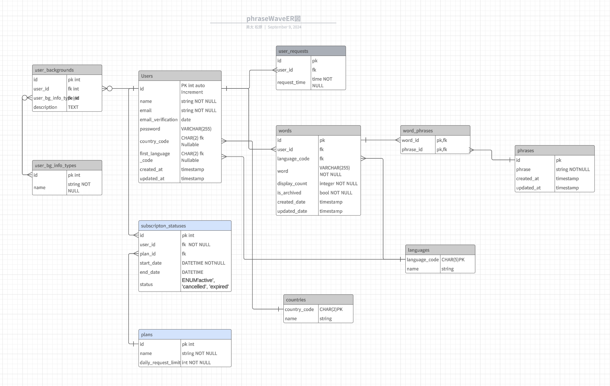
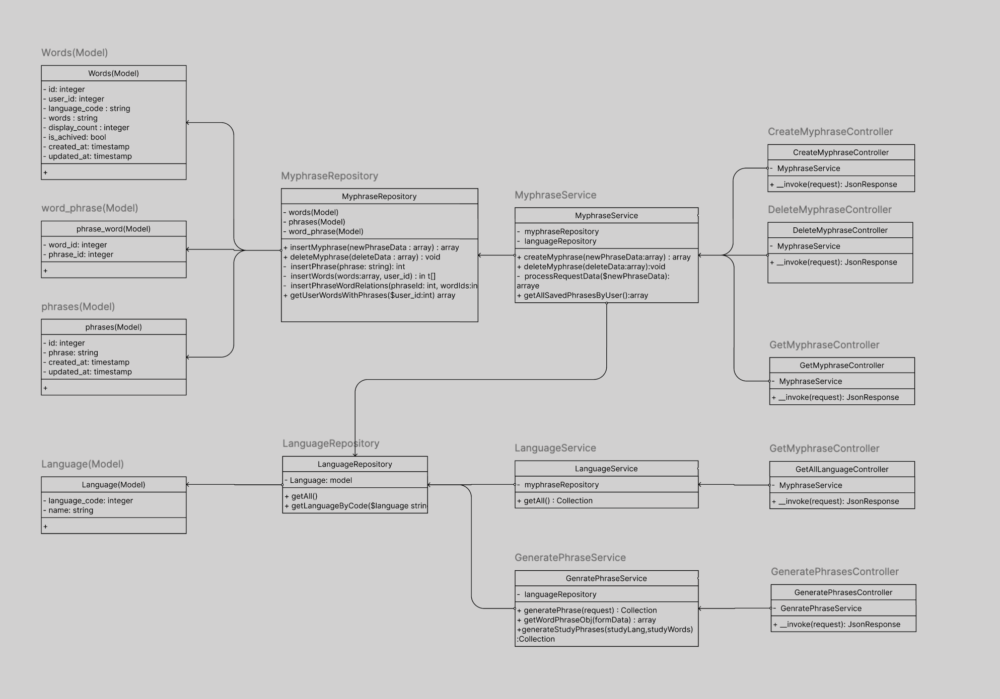

# Phrase Wave バックエンド

## アプリケーション概要
Phrase Waveは、言語学習者のためのWebアプリケーションです。このリポジトリはバックエンドAPIを管理します。フロントエンドからのリクエストを処理し、OpenAI APIを使用して例文を生成し、ユーザーデータを管理します。

API URL: https://api.phrasewave.com/

※現バージョンでは単純に入力した単語を組み合わせて例文を生成し、保存をすることしかできませんが、今後のバージョンではユーザーのプロフィールに合わせた例文の生成、過去に学んだ単語が復習できるように、新たな例文生成時に組み込むことができるように機能を追加していきます。

## 主要機能
- ユーザー認証・管理API(Laravel Breeze)
- OpenAI APIを利用した例文生成
- ユーザーのフレーズ保存・取得API

## 技術スタック
- 言語: PHP 8.2+
- フレームワーク: Laravel 11.x
- AI 統合: OpenAI PHP SDK for Laravel (openai-php/laravel ^0.10.1)
- データベース: MySQL (Amazon RDS)
- 認証: Laravel Sanctum
- API: RESTful API

### インフラストラクチャ
- クラウドプラットフォーム: AWS (Amazon Web Services)
- フロントエンドホスティング: AWS Amplify
- コンテナ化: Docker
- データベース: Amazon RDS
- 仮想プライベートクラウド (VPC)
  - パブリックサブネット (アプリケーションサーバー用)
  - プライベートサブネット (データベース用)
- ロードバランシング: Elastic Load Balancer (ELB)
- コンピューティング: Amazon EC2
- ドメイン管理・DNS: Amazon Route 53

## サーバー構成

## データベース構造 (ER図)
水色部分は未実装(サービスの有料化を見据えたテーブル)
UserRequestsテーブルも今回のバージョンでは未使用(無料会員の利用回数制限用)

主要テーブル：
*現在のβ版では利用していないテーブル･カラムが多数あります
- users: ユーザー情報を管理
- user_backgrounds:ユーザーの付随情報を管理(将来的にはこれらの情報を例文生成次のリクエストに含める)
- phrases: 生成された例文とそれに関連する単語を保存
- words:生成された単語を保存(例文として何回利用されたかの履歴情報も保存)
- user_phrases: ユーザーと保存された例文の関連を管理

## UML図

### シングルアクションコントローラーの採用
各コントローラーはシングルアクションコントローラーとして設計されています。これにより、各コントローラーが単一の責務を持つようになり、コードの可読性と保守性が向上します。シングルアクションコントローラーの導入により、各アクションの処理内容が明確になり、テストの容易さも確保されています。

### Repository層とService層の分離
アプリケーションのビジネスロジックとデータアクセスロジックを明確に分離するために、Repository層とService層を別々に設けています。

Repository層: データベースとの直接的なやり取りを担当し、データの取得、保存、更新、削除などの操作を行います。これにより、データアクセスに関するコードが一元化され、他の部分から独立して管理できます。

Service層: ビジネスロジックを実装し、複数のリポジトリを組み合わせて複雑な操作を行います。Service層を設けることで、ビジネスルールの変更が容易になり、再利用性の高いコード構造を実現しています。

## API エンドポイント
*ユーザー認証関連以外の自分で開発したAPIを下記にドキュメント化しています
https://app.swaggerhub.com/apis-docs/MYUTADEV/phrasewave-api/1.0.0#/

## 今後の開発予定
- パフォーマンス最適化
- キャッシュ層の追加
- 翻訳+音声読み上げ用の外部APIリクエスト機能の実装
- 単語帳機能の実装
- OpenAI APIの利用制限の実装
- ユーザープロフィールに基づいたカスタム例文生成ロジックの実装
